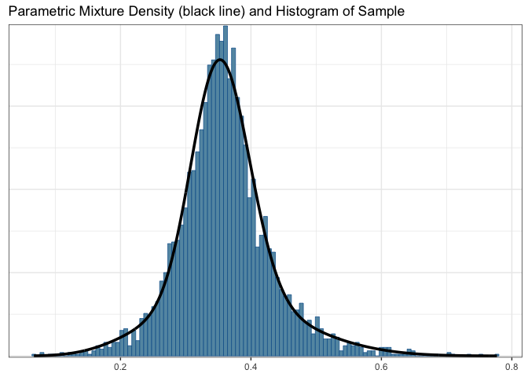

# Self-adapting Mixture (SAM) Priors

## Description

The self-adapting mixture prior (SAMprior) package is designed to
enhance the effectiveness and practicality of clinical trials by
leveraging historical information or real-world data \[1\]. The package
incorporate historical data into a new trial using an informative prior
constructed based on historical data while mixing a non-informative
prior to enhance the robustness of information borrowing. It utilizes a
data-driven way to determine a self-adapting mixture weight that
dynamically favors the informative (non-informative) prior component
when there is little (substantial) evidence of prior-data conflict.
Operating characteristics are evaluated and compared to the robust
Meta-Analytic-Predictive (rMAP) prior \[2\], which assigns a fixed
weight of 0.5.

## Installation

To install the package:

``` r
install.packages('devtools')
devtools::install_github("pengyang0411/SAMprior")
```

## Usage

Consider a randomized clinical trial to compare a treatment with a
control in patients with ankylosing spondylitis. The primary efficacy
endpoint is binary, indicating whether a patient achieves 20%
improvement at week six according to the Assessment of SpondyloArthritis
International Society criteria \[3\]. Nine historical data available to
the control were used to construct the MAP prior:

| study                 |   n |   r |
|:----------------------|----:|----:|
| Baeten (2013)         |   6 |   1 |
| Deodhar (2016)        | 122 |  35 |
| Deodhar (2019)        | 104 |  31 |
| Erdes (2019)          |  23 |  10 |
| Huang (2019)          | 153 |  56 |
| Kivitz (2018)         | 117 |  55 |
| Pavelka (2017)        |  76 |  28 |
| Sieper (2017)         |  74 |  21 |
| Van der Heijde (2018) |  87 |  35 |

### SAM Prior Derivation

SAM prior is constructed by mixing an informative prior $\pi_1(\theta)$, 
constructed based on historical data, with a non-informative prior 
$\pi_0(\theta)$ using the mixture weight $w$ determined by **`SAM_weight`**
function to achieve the degree of prior-data conflict \[1\]. The following 
sections describe how to construct SAM prior in details.

#### Informative Prior Construction based on Historical Data

To construct informative priors based on the aforementioned nine historical 
data, we apply **`gMAP`** function from RBesT to perform meta-analysis. This 
informative prior results in a representative form from a large MCMC samples, 
and it can be converted to a parametric representation with the 
**`automixfit`** function using expectation-maximization (EM) algorithm \[4\].
This informative prior is also called MAP prior.

``` r
# load R packages
library(ggplot2)
theme_set(theme_bw()) # sets up plotting theme
set.seed(22)
map_ASAS20 <- gMAP(cbind(r, n-r) ~ 1 | study,
                   family = binomial,
                   data = ASAS20, 
                   tau.dist = "HalfNormal", 
                   tau.prior = 1,
                   beta.prior = 2)
```

    ## Assuming default prior location   for beta: 0

``` r
map_automix <- automixfit(map_ASAS20)
map_automix
```

    ## EM for Beta Mixture Model
    ## Log-Likelihood = 5005.173
    ## 
    ## Univariate beta mixture
    ## Mixture Components:
    ##   comp1      comp2     
    ## w  0.6347375  0.3652625
    ## a 42.5097011  7.1944569
    ## b 77.2077293 12.3741342

``` r
plot(map_automix)$mix
```




The resulting MAP prior is approximated by a mixture of conjugate priors, 
given by $\pi_1(\theta) = 0.63 Beta(42.5, 77.2) + 0.37 Beta(7.2, 12.4)$, with 
$\hat{\theta}_h \approx 0.36$.

#### SAM Weight Determination

Let $\theta$ and $\theta_h$ denote the treatment effects associated with the
current arm data $D$ and historical $D_h$, respectively. Let $\delta$ denote
the clinically significant difference such that is $|\theta_h - \theta| \ge \delta$,
then $\theta_h$ is regarded as clinically distinct from $\theta$, and it is 
therefore inappropriate to borrow any information from $D_h$. Consider two
hypotheses:

$$
H_0: \theta = \theta_h, ~~ H_1: \theta = \theta_h + \delta ~ \text{or} ~ \theta = \theta_h - \delta.
$$

$H_0$ represents that $D_h$ and $D$ are consistent (i.e., no prior-data 
conflict) and thus information borrowing is desirable, whereas $H_1$ represents
that the treatment effect of $D$ differs from $D_h$ to such a degree that no
information should be borrowed.

The SAM prior uses the likelihood ratio test (LRT) statistics $R$ to quantify
the degree of prior-data conflict and determine the extent of information 
borrowing.

$$
R = \frac{P(D | H_0, \theta_h)}{P(D | H_1, \theta_h)} = \frac{P(D | \theta = \theta_h)}{\max \{ P(D | \theta = \theta_h + \delta), P(D | \theta = \theta_h - \delta) \}} ,
$$

where $P(D | \cdot)$ denotes the likelihood function. An alternative Bayesian
choice is the posterior probability ratio (PPR):

$$
R = \frac{P(D | H_0, \theta_h)}{P(D | H_1, \theta_h)} = \frac{P(H_0)}{P(H_1)} \times BF ,
$$

where $P(H_0)$ and $P(H_1)$ is the prior probabilities of $H_0$ and $H_1$ 
being true. $BF$ is the Bayes Factor that in this case is the same as LRT.

The SAM prior, denoted as $\pi_{sam}(\theta)$, is then defined as a mixture
of an informative prior $\pi_1(\theta)$, constructed based on $D_h$, with a 
non-informative prior $\pi_0(\theta)$:

$$
\pi_{sam}(\theta) = w \pi_1(\theta) + (1 - w) \pi_0(\theta),
$$

where the mixture weight $w$ is calculated as:

$$
w = \frac{R}{1 + R}.
$$ 

As the level of prior-data conflict increases, the likelihood ratio $R$ 
decreases, resulting in a decrease in the weight $w$ assigned to the 
informative prior and a decrease in information borrowing. As a result,
$\pi_{sam}(\theta)$ is data-driven and has the ability to self-adapt the 
information borrowing based on the degree of prior-data conflict.

To calculate mixture weight $w$ of the SAM prior, we assume the sample size 
enrolled in the control arm is $n = 35$, with $r = 10$ responses, then we can 
apply function **`SAM_weight`** in SAMprior as follows: 

``` r
n <- 35; r = 10 
wSAM <- SAM_weight(if.prior = map_automix, 
                   delta = 0.2,
                   n = n, r = r)
cat('SAM weight: ', wSAM)
```

    ## SAM weight:  0.7900602

The default method to calculate $w$ is using LRT, which is fully
data-driven. However, if investigators want to incorporate prior
information on prior-data conflict to determine the mixture weight $w$,
this can be achieved by using PPR method as follows:

``` r
wSAM <- SAM_weight(if.prior = map_automix, 
                   delta = 0.2,
                   method.w = 'PPR',
                   prior.odds = 3/7,
                   n = n, r = r)
cat('SAM weight: ', wSAM)
```

    ## SAM weight:  0.6172732

The **`prior.odds`** indicates the prior probability of $H_0$ over the prior 
probability of $H_1$. In this case (e.g., **`prior.odds = 3/7`**), the prior 
information favors the presence prior-data conflict and it results in a 
decreased mixture weight.

When historical information is congruent with the current control arm, SAM 
weight reaches to the highest peak. As the level of prior-data conflict 
increases, SAM weight decreases. This demonstrates that SAM prior is data-driven
and self-adapting, favoring the informative (non-informative) prior component 
when there is little (substantial) evidence of prior-data conflict.


#### SAM Prior Construction

To construct the SAM prior, we mix the derived informative prior $\pi_1(\theta)$ 
with a vague prior $\pi_0(\theta)$ using pre-determined mixture weight by 
**`SAM_prior`** function in SAMprior as follows: 

``` r
SAM.prior <- SAM_prior(if.prior = map_automix, 
                       nf.prior = mixbeta(nf.prior = c(1,1,1)),
                       weight = wSAM)
SAM.prior
```

    ## Univariate beta mixture
    ## Mixture Components:
    ##   comp1      comp2      nf.prior  
    ## w  0.3918065  0.2254667  0.3827268
    ## a 42.5097011  7.1944569  1.0000000
    ## b 77.2077293 12.3741342  1.0000000

where the non-informative prior $\pi_0(\theta)$ follows a uniform distribution.

#### Decision Making

Finally, we present an example of how to make a final decision on
whether the treatment is superior or inferior to a standard control once
the trial has been completed and data has been collected. This step can
be accomplished using the **`postmix`** function from RBesT, as shown
below:

``` r
## Sample size and number of responses for treatment arm
n_t <- 70; x_t <- 22 

## first obtain posterior distributions...
post_SAM <- postmix(priormix = SAM.prior,         ## SAM Prior
                    r = r,   n = n)
post_trt <- postmix(priormix = mixbeta(c(1,1,1)), ## Non-informative prior
                    r = x_t, n = n_t)

## Define the decision function
decision = decision2S(0.95, 0, lower.tail=FALSE)

## Decision-making
decision(post_trt, post_SAM)
```

    ## [1] 0

## Maintainer information

Peng Yang ([py11@rice.edu](mailto:py11@rice))

## Citation

\[1\] Yang P. et al., *Arxiv*, <https://arxiv.org/abs/2305.12279>.  
\[2\] Schmidli H. et al., *Biometrics* 2014;70(4):1023-1032.  
\[3\] Baeten D. et al., *The Lancet*, 2013, (382), 9906, p 1705.  
\[4\] Neuenschwander B. et al., *Clin Trials*. 2010; 7(1):5-18.
